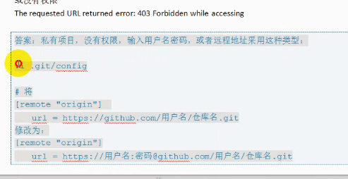

# TestRepository

- 借助github托管项目代码

        repository 一个开源项目又有一个仓库
        star 收藏 方便查找 your stars
        fork 复制克隆项目 fork项目独立存在
        pull request 发起请求 create pull request --> merge pull request --> confirm merge
        watch 关注
        issue 事务卡片（发现bug 要讨论）

        github主页
        仓库主页
        个人主页

- 仓库管理

        删除文件： 点击`commits`查看被删除文件信息
        搜索文件： find file（快捷键 `t` 或 `T`）

- Github Issues
        
        双方都有权限close issue

- 如何为开源项目做出贡献

        1. 新建issue 

                提交使用问题或者建议或者想法

        2. Pull request 

                步骤：
                fork项目
                修改自己仓库的项目代码
                新建pull request
                等待作者操作（合并）

---

## [Git](https://git-scm.com/download/win)  

通过`git`管理`github`托管项目代码
        
- ### Git工作区域
1. Git Repository（Git仓库）最终确定的文件保存到仓库，成为一个新的版本，并对他人可见
2. 暂存区 暂存已经修改的文件最后统一提交到Git仓库中
3. 工作区（Working Directory）添加、编辑、修改文件等动作  

工作区`git add filename` --> 暂存区`git commit -m "description"` --> Git仓库  
`git status`

        nothing to commit (create/copy files and use "git add" to track)
        无需提交（创建/复制文件并使用“git add”进行跟踪）
        
        nothing added to commit but untracked files present (use "git add" to track)
        没有添加到提交但未跟踪的文件存在（使用“git add”跟踪）
        
        Changes to be committed

- ### Git基础设置

``` git
$ git config --list
# 该设置在GitHub仓库主页显示谁提交了该文件
$ git config --global user.name 'Ucann'
$ git config --global user.email '123@456.com'

$ mkdir repositories
$ cd repositories/
# 在文件内初始化git（创建git仓库） .git文件存储仓库所有信息
$ git init

# 添加或修改文件
$ git add hello.java
$ git commit -m "add file hello.java"

# 删除文件
$ git rm 'hello.java'
$ git commit -m 'delete hello.java'

```

- ### Git管理远程仓库
备份、实现代码共享集中化管理

工作区`git add filename` --> 暂存区`git commit -m "description"` --> Git仓库  
--> `git push` 将本地仓库同步到git远程仓库

- ### Git克隆操作
将远程仓库（github对应的项目）复制到本地 `git clone`仓库地址

```git
$ git clone https://github.com/Ucann/TestRepository.git
$ git push
$ vi .git/config
```

- ### 为什么无法同步 —— 解决`git push`错误


- ### Github Pages搭建网站
#### 个人网站  
- 访问 https://用户名.github.io
- 搭建步骤  
        1. 创建个人站点 -> 新建仓库（注意：仓库名必须是 用户名.github.io）
        2. 在仓库下新建index.html的文件  
        
        注意：github pages只支持静态网页，仓库里面只能是.html文件        
  
#### 项目站点
- 访问 https://用户名.github.io/仓库名
- 搭建步骤
        1. 进入项目主页，点击settings
        2. 在settings页面，点击[Launch automatic page generator]来自动生成主题页面
        3. 新建站点基础信息设置
        4. 选择主题
        5. 生成网页`Publish page`
       
        项目名称
        项目描述
        具体信息都可以动态修改
        版权信息在branch中修改


[Reference](https://github.com/yezhaodan/-Git/blob/master/GitLearning.md)
